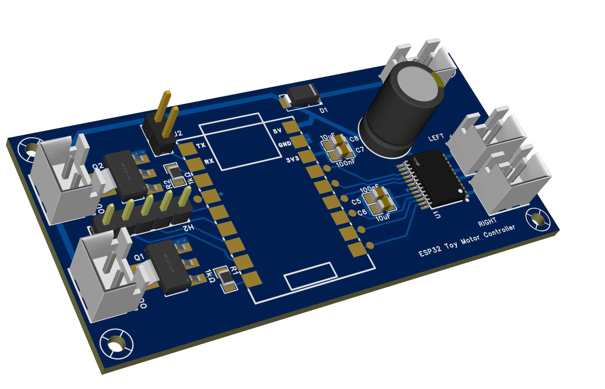

# ESP32 Toy Motor Controller

A compact dual DC motor controller board designed around the **ESP32S3-Super Mini** module and the **TB6612FNG** dual H-bridge motor driver.

This project targets small toy hacking with reliable bidirectional DC motor control, PWM speed control, and simple GPIO-controlled switching of accessories.



---

## Overview

The board integrates:
- An **ESP32S3-Super Mini** module
- A **TB6612FNG** dual H-bridge motor driver
- Two GPIO-controlled low-side switches using NPN transistors
- On-board decoupling and bulk capacitance for motor stability
- Schottky diode reverse polarity protection on the motor supply input
- Serial header and expansion GPIO header

---

## Key Features

- Dual DC motor control (independent speed and direction)
- ESP32-S3 controller with Wi-Fi / BLE capability
- Efficient TB6612FNG motor driver (lower loss than legacy H-bridges)
- Two low-side switched outputs using NPN transistors

---

## Hardware Architecture

### Microcontroller

- **ESP32S3-Super Mini**
- GPIOs directly control motor driver and switch circuitry

### Motor Driver

- **TB6612FNG Dual H-Bridge**
- Motor connections:
  - Motor A: AO1 / AO2
  - Motor B: BO1 / BO2
- Control signals:
  - AIN1, AIN2, PWMA
  - BIN1, BIN2, PWMB
- Motor supply via VM (VCC)

### Power

- **VCC input connector (CN3)**
  - Supplies motor driver VM
  - SS34 Schottky diode (D1) provides reverse polarity protection (~0.4 V forward drop)
  - Bulk capacitor: 470 µF for transient suppression
- **3.3 V logic rail**
  - Local decoupling: 100 nF + 10 µF
- Common ground between logic and motor domains

### Switch Outputs (Low-Side Switching)

- Two GPIO-controlled switches implemented using **NPN transistors**
- Low-side switching topology
- Suitable for driving small loads referenced to VCC

---

## Connectors

| Connector | Function |
|---------|---------|
| CN1 | Motor 1 output (RIGHT) |
| CN2 | Motor 2 output (LEFT) |
| CN3 | VCC power input |
| CN4 | Switch 2 output |
| CN5 | Switch 1 output |
| H1 | Serial header (TX, RX) |
| H2 | GPIO expansion header (GP3–GP6, GND) |

---

## ESP32S3-Super Mini GPIO Mapping

### Motor Driver (TB6612FNG)

| ESP32S3-Super Mini GPIO | TB6612FNG Signal | Function |
|---------------|------------------|----------|
| GP2  | STBY | Motor driver enable (HIGH = enabled) |
| GP8  | PWMA | Motor A speed |
| GP10 | AIN1 | Motor A direction |
| GP9  | AIN2 | Motor A direction |
| GP13 | PWMB | Motor B speed |
| GP11 | BIN1 | Motor B direction |
| GP12 | BIN2 | Motor B direction |

### Switch Control

| ESP32S3-Super Mini GPIO | Function |
|-------------------------|----------|
| GP1 | Switch 1 control |
| GP7 | Switch 2 control |

- Switches use **NPN low-side switching** (PZT2222A): drive GPIO **HIGH to turn the switch ON**, **LOW to turn it OFF**.
- Both switches default to OFF (GPIO LOW) at boot.

### GPIO Expansion (H2)

| H2 Pin | ESP32S3-Super Mini GPIO |
|--------|------------------------|
| 1 | GP3 |
| 2 | GP4 |
| 3 | GP5 |
| 4 | GP6 |
| 5 | GND |

---

## Arduino Software

### Requirements

- **Arduino IDE** with the **ESP32 board package** installed
- Board: **ESP32S3 Dev Module**
- Core: **Espressif ESP32 Arduino core v3.x or later** — required for `ledcAttach()`. Install via Arduino IDE > Boards Manager > "esp32 by Espressif Systems" >= 3.0.0
- USB CDC On Boot: **Enabled** (for Serial monitor over USB)

### Example Sketch — Forward/Backward Toggle

The included sketch `esp32-toy-motor-controller.ino` demonstrates basic bidirectional control of both motors.

**What it does:**

1. Runs Motor A and Motor B **forward** for 2 seconds (onboard LED on, GPIO 48)
2. Stops briefly (400 ms coast)
3. Runs Motor A and Motor B **backward** for 2 seconds (LED off)
4. Stops briefly and repeats

**Key constants to adjust:**

| Constant | Default | Description |
|---|---|---|
| `MOTOR_SPEED` | `180` | PWM duty cycle, 0–255 (≈70% speed) |
| `PWM_FREQ` | `5000` | PWM frequency in Hz |
| `PWM_RESOLUTION` | `8` | PWM bit depth (8-bit = 0–255 range) |

**Motor direction helper functions:**

```cpp
motorA_forward(speed);   // AIN1=H, AIN2=L
motorA_backward(speed);  // AIN1=L, AIN2=H
motorA_stop();           // Coast: AIN1=L, AIN2=L

motorB_forward(speed);   // BIN1=H, BIN2=L
motorB_backward(speed);  // BIN1=L, BIN2=H
motorB_stop();           // Coast: BIN1=L, BIN2=L
```

**TB6612FNG direction truth table:**

| AIN1 / BIN1 | AIN2 / BIN2 | Motor action |
|---|---|---|
| HIGH | LOW  | Forward |
| LOW  | HIGH | Backward |
| LOW  | LOW  | Coast (stop) |
| HIGH | HIGH | Brake |

**Serial monitor output (115200 baud):**

```
Motor controller ready.
Motor A + B: FORWARD
Motor A + B: BACKWARD
...
```

> **Note on PWM API:** The sketch uses `ledcAttach()` and `ledcWrite()` from ESP32 Arduino core v3+.
> If using an older core (v2.x), replace with `ledcSetup()` / `ledcAttachPin()` / `ledcWrite()` using channel numbers.

---

## Power & Electrical Considerations

- Design is intended for **small DC motors and low-current switched loads**
- Motor supply reverse polarity protected by SS34 Schottky diode (~0.4 V drop)
- No current sensing
- External motor suppression may be required for noisy loads

---

## Notes & Limitations

- Not suitable for high-current motors
- No hardware fault protection
- ESP32 module pinout must match the 18-pin layout described above
