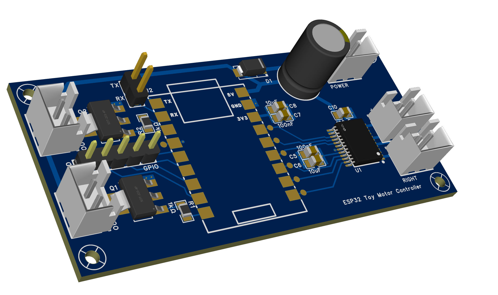
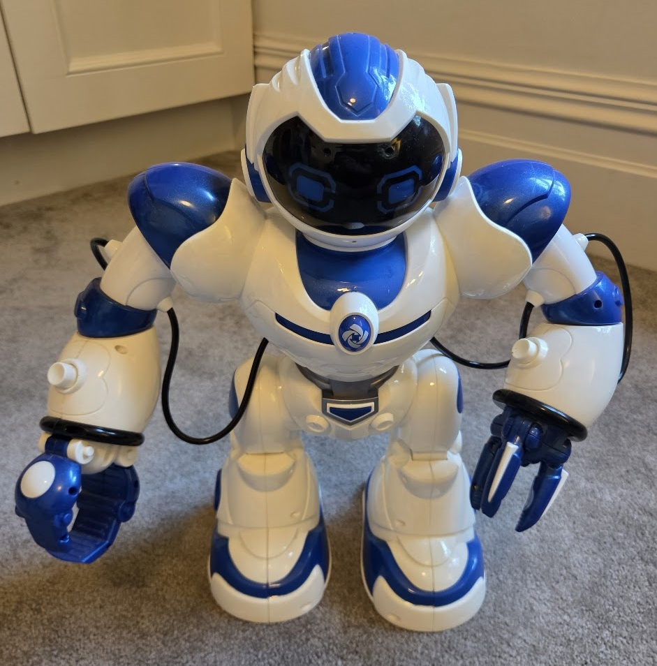
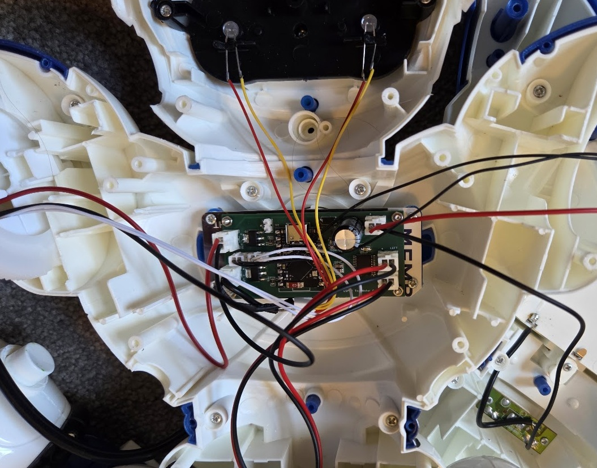
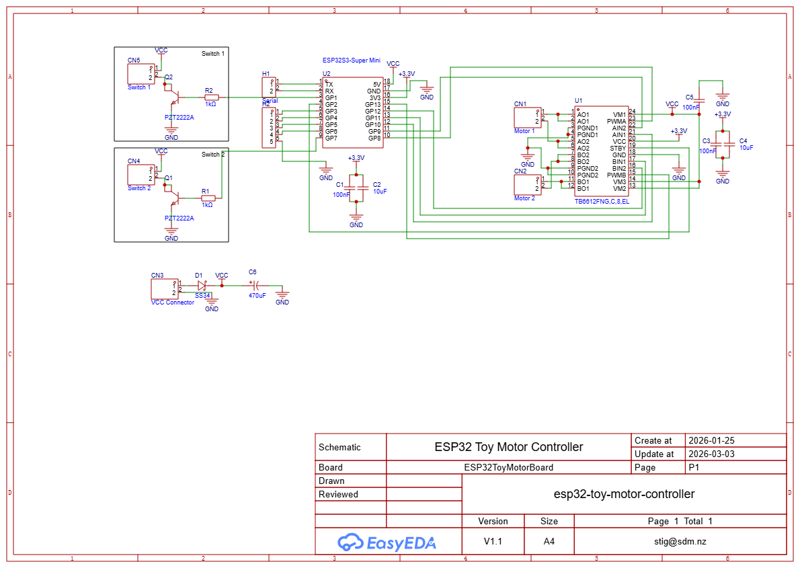

# ESP32 Toy Motor Controller

A compact dual DC motor controller board designed around the **ESP32S3-Super Mini** module and the **TB6612FNG** dual H-bridge motor driver.

This project targets small toy hacking with reliable bidirectional DC motor control, PWM speed control, and simple GPIO-controlled switching of accessories.



|  |  |
|:---:|:---:|
| Target toy | PCB installed inside |

---

## Overview

The board integrates:
- An **ESP32S3-Super Mini** module
- A **TB6612FNG** dual H-bridge motor driver
- Two GPIO-controlled low-side switches using NPN transistors
- On-board decoupling and bulk capacitance for motor stability
- Schottky diode reverse polarity protection on the motor supply input
- Serial header and expansion GPIO header

---

## Key Features

- Dual DC motor control (independent speed and direction)
- ESP32-S3 controller with Wi-Fi / BLE capability
- Efficient TB6612FNG motor driver (lower loss than legacy H-bridges)
- Two low-side switched outputs using NPN transistors

---

## Hardware Architecture



### Microcontroller

- **ESP32S3-Super Mini**
- GPIOs directly control motor driver and switch circuitry

### Motor Driver

- **TB6612FNG Dual H-Bridge**
- Motor connections:
  - Motor A: AO1 / AO2
  - Motor B: BO1 / BO2
- Control signals:
  - AIN1, AIN2, PWMA
  - BIN1, BIN2, PWMB
- Motor supply via VM (VCC)

### Power

- **VCC input connector (CN3)**
  - Supplies motor driver VM
  - SS34 Schottky diode (D1) provides reverse polarity protection (~0.4 V forward drop)
  - Bulk capacitor: 470 µF for transient suppression
- **3.3 V logic rail**
  - Local decoupling: 100 nF + 10 µF
- Common ground between logic and motor domains

### Switch Outputs (Low-Side Switching)

- Two GPIO-controlled switches implemented using **NPN transistors**
- Low-side switching topology
- Suitable for driving small loads referenced to VCC

---

## Connectors

| Connector | Function |
|---------|---------|
| CN1 | Motor 1 output (RIGHT) |
| CN2 | Motor 2 output (LEFT) |
| CN3 | VCC power input |
| CN4 | Switch 2 output |
| CN5 | Switch 1 output |
| H1 | Serial header (TX, RX) |
| H2 | GPIO expansion header (GP3–GP6, GND) |

---

## ESP32S3-Super Mini GPIO Mapping

### Motor Driver (TB6612FNG)

| ESP32S3-Super Mini GPIO | TB6612FNG Signal | Function |
|---------------|------------------|----------|
| GP2  | STBY | Motor driver enable (HIGH = enabled) |
| GP8  | PWMA | Motor A speed |
| GP10 | AIN1 | Motor A direction |
| GP9  | AIN2 | Motor A direction |
| GP13 | PWMB | Motor B speed |
| GP11 | BIN1 | Motor B direction |
| GP12 | BIN2 | Motor B direction |

### Switch Control

| ESP32S3-Super Mini GPIO | Function |
|-------------------------|----------|
| GP1 | Switch 1 control |
| GP7 | Switch 2 control |

- Switches use **NPN low-side switching** (PZT2222A): drive GPIO **HIGH to turn the switch ON**, **LOW to turn it OFF**.
- Both switches default to OFF (GPIO LOW) at boot.

### GPIO Expansion (H2)

| H2 Pin | ESP32S3-Super Mini GPIO |
|--------|------------------------|
| 1 | GP3 |
| 2 | GP4 |
| 3 | GP5 |
| 4 | GP6 |
| 5 | GND |

---

## Arduino Sketches

### Arduino IDE Setup

- **Board:** ESP32S3 Dev Module
- **Core:** Espressif ESP32 Arduino core v3.x or later — required for `ledcAttach()`. Install via Arduino IDE > Boards Manager > "esp32 by Espressif Systems" >= 3.0.0
- **USB CDC On Boot:** Enabled (for Serial monitor over USB)

All sketches that require WiFi credentials use a `secrets.h` file (not committed). Copy `example.secrets.h` (or `secrets.h.example`) to `secrets.h` and fill in your details:

```cpp
const char *ssid     = "your-network-name";
const char *password = "your-password";
```

---

### `motor-switch-test` — Hardware Test

[`arduino/motor-switch-test/`](arduino/motor-switch-test/)

Confirms motors, switches, and GPIO wiring are working correctly. No WiFi required.

**What it does:**
1. Runs both motors **forward** for 2 s (LED on, SW1 on, SW2 off)
2. Coasts briefly (400 ms)
3. Runs both motors **backward** for 2 s (LED off, SW1 off, SW2 on)
4. Coasts and repeats

**Serial output (115200 baud):**
```
Motor controller ready.
Motor A + B: FORWARD  | SW1 ON, SW2 OFF
Motor A + B: BACKWARD | SW1 OFF, SW2 ON
...
```

---

### `example-ota-controller` — Hardware Test with OTA

[`arduino/example-ota-controller/`](arduino/example-ota-controller/)

Same forward/backward loop as `motor-switch-test`, but adds WiFi connectivity and **ArduinoOTA** support so subsequent firmware updates can be pushed wirelessly.

**After the initial USB flash:**
```bash
python "espota.py" \
  -i <device-ip> \
  -f "build/esp32.esp32.esp32s3/example-ota-controller.ino.bin"
```

The device IP is printed over serial on boot.

Requires `secrets.h` with WiFi credentials (see above).

---

### `wifi-browser-control` — Browser-Based Remote Control

[`arduino/wifi-browser-control/`](arduino/wifi-browser-control/)

Full differential-drive controller served from the ESP32 as a mobile-friendly web page. Includes ArduinoOTA.

Open `http://<device-ip>` in any browser:


| Control | Behaviour |
|---|---|
| **↑ Forward** | Both motors forward — hold to move |
| **↓ Backward** | Both motors backward — hold to move |
| **← Left** | Pivot left (right motor fwd, left motor bwd) — hold |
| **→ Right** | Pivot right (left motor fwd, right motor bwd) — hold |
| **■ Stop** | Immediately stops both motors |
| **Speed slider** | Sets motor PWM duty cycle (50–255) |
| **Shoot** | Triggers SW1 for 5 seconds then auto-stops |
| **Headlight** | Toggles SW2 on/off |

Direction buttons stop motors on release. Re-pressing Shoot resets the 5-second timer.

If a motor runs in the wrong direction, flip its flag in the sketch instead of swapping wires:
```cpp
#define REVERSE_RIGHT  true   // CN1 — set true if right motor runs backward
#define REVERSE_LEFT   false  // CN2 — set true if left motor runs backward
```

**OTA upload after initial flash:**
```bash
python "espota.py" \
  -i <device-ip> \
  -f "build/esp32.esp32.esp32s3/wifi-browser-control.ino.bin"
```

Requires `secrets.h` with WiFi credentials (see above).

---

## Power & Electrical Considerations

- Design is intended for **small DC motors and low-current switched loads**
- Motor supply reverse polarity protected by SS34 Schottky diode (~0.4 V drop)
- **Use a dedicated 5 V 1 A+ supply** — USB power causes the 3.3 V rail to sag
- No current sensing
- External motor suppression may be required for noisy loads

---

## Notes & Limitations

- Not suitable for high-current motors
- No hardware fault protection
- ESP32 module pinout must match the 18-pin layout described above
