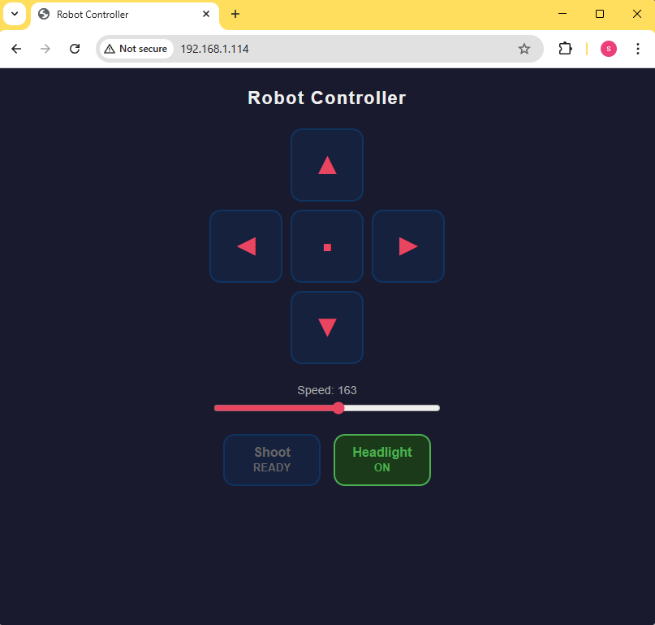

# WiFi Browser Control

Browser-based controller for the ESP32S3 toy motor controller PCB.
Drives two DC motors (differential drive) and controls a shoot actuator and headlight via a mobile-friendly webpage.

## Hardware

- **MCU:** ESP32S3-Super Mini
- **Motor driver:** TB6612FNG dual H-bridge
- **Supply:** 5 V, 1 A minimum (USB power causes 3.3 V rail sag — use a dedicated supply)

## PCB Connectors

| Connector | Silkscreen label | Function          | GPIO | Notes                                               |
|-----------|------------------|-------------------|------|-----------------------------------------------------|
| **CN1**   | Right            | Right motor       | —    |                                                     |
| **CN2**   | Left             | Left motor        | —    |                                                     |
| **CN4**   | Out 2            | Headlight         | GP7  | Requires current-limiting resistor — 68 Ω for LED   |
| **CN5**   | Out 1            | Shoot actuator    | GP1  |                                                     |

> If a motor runs in the wrong direction, flip its flag in the sketch instead of swapping wires:
> ```cpp
> #define REVERSE_RIGHT  true   // CN1 — set true if right motor runs backward
> #define REVERSE_LEFT   false  // CN2 — set true if left motor runs backward
> ```

## GPIO Map

| GPIO | Function         |
|------|------------------|
| 2    | STBY (motor enable) |
| 8    | PWMA (right motor speed) |
| 9    | AIN2             |
| 10   | AIN1             |
| 11   | BIN1             |
| 12   | BIN2             |
| 13   | PWMB (left motor speed) |
| 1    | SW1 — Shoot actuator (CN5) |
| 7    | SW2 — Headlight (CN4)      |
| 48   | Onboard LED      |

## Arduino IDE Setup

| Setting          | Value                        |
|------------------|------------------------------|
| Board            | ESP32S3 Dev Module           |
| Core             | Espressif ESP32 v3.x or later |
| USB CDC On Boot  | Enabled                      |
| Upload speed     | 921600                       |

WiFi credentials go in `secrets.h` (not committed). Rename `example.secrets.h` to `secrets.h` and fill in your details:

```cpp
const char *ssid     = "your-network-name";
const char *password = "your-password";
```

## OTA Upload
After the initial USB flash, subsequent uploads can remote upload firmware over wifi using `espota.py`:

In Arduino 2 use Sketch -> Export Compiled Binary then:

```bash
python "espota.py" \
  -i <device-ip> \
  -f "build/esp32.esp32.esp32s3/wifi-browser-control.ino.bin"
```

The device IP is printed over serial on boot.

## Web Interface

Open `http://<device-ip>` in any browser (works on mobile).



| Control         | Behaviour                                              |
|-----------------|--------------------------------------------------------|
| **↑ Forward**   | Both motors forward — hold to move                     |
| **↓ Backward**  | Both motors backward — hold to move                    |
| **← Left**      | Pivot left (right motor fwd, left motor bwd) — hold    |
| **→ Right**     | Pivot right (left motor fwd, right motor bwd) — hold   |
| **■ Stop**      | Immediately stops both motors                          |
| **Speed slider**| Sets motor PWM duty cycle (50–255)                     |
| **Shoot**       | Triggers SW1 actuator for 5 seconds then auto-stops    |
| **Headlight**   | Toggles SW2 on/off                                     |

Direction buttons stop the motors on release. The Shoot button re-pressing resets the 5-second timer.
